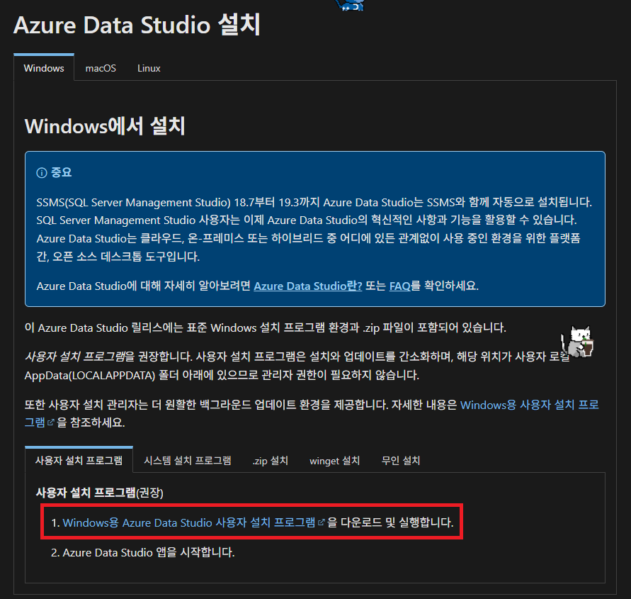
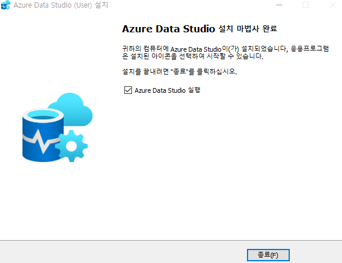
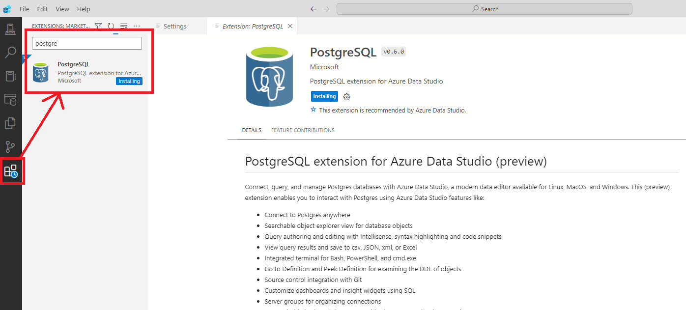
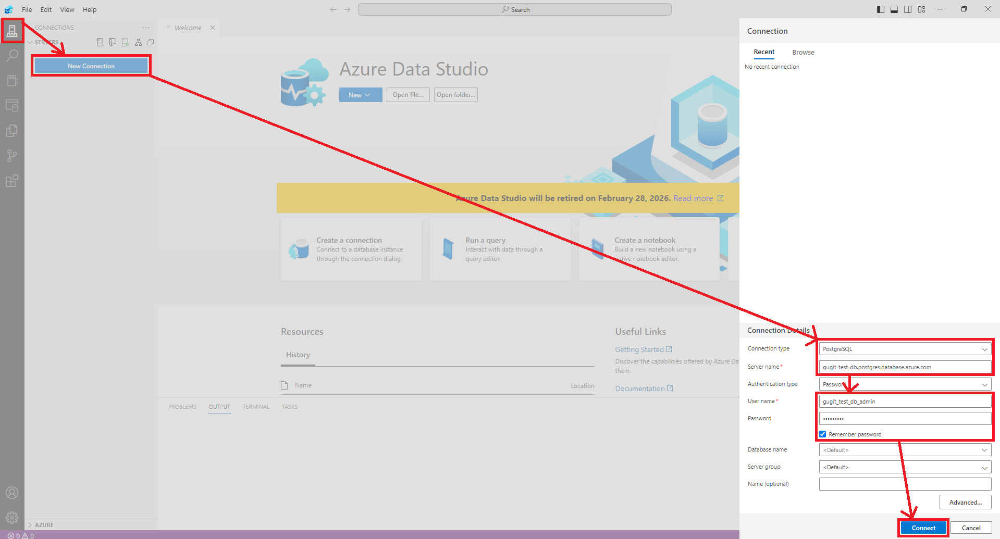
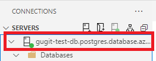

# Azure Data Studio

## 1. 설치

### 1.1. 다운로드

- [Azure Data Studio 다운로드 및 설치](https://learn.microsoft.com/ko-kr/azure-data-studio/download-azure-data-studio?tabs=win-install%2Cwin-user-install%2Credhat-install%2Cwindows-uninstall%2Credhat-uninstall)에서 다운로드 및 설치 방법을 확인할 수 있습니다.

### 1.2. 설치

- 다운로드 받은 파일을 실행하여 설치를 진행합니다.

## 2. 데이터베이스 연결

### 2.1. PostgreSQL Extension 설치

- Azure Data Studio에서 데이터베이스 연결을 위한 PostgreSQL Extension을 설치합니다.

### 2.2. 데이터베이스 연결

- 데이터베이스 연결을 위해 정보를 입력합니다.
  - `Connection type`을 `PostgreSQL`로 선택합니다.
  - `Server name`에 데이터베이스 서버의 주소(`gugit-test-db.postgres.database.azure.com`)를 입력합니다.
    - 데이터베이스 리소스의 엔드포인트가 서버의 주소이다.
  - `User name`에 데이터베이스 서버의 사용자 이름(`gugit_test_db_admin`)을 입력합니다.
    - 리소스 생성 시 만들었던 사용자 이름을 입력합니다.
  - `Password`에 데이터베이스 서버의 비밀번호를 입력합니다.

- 연결 완료되면 아래처럼 데이터베이스 목록을 확인할 수 있습니다.

