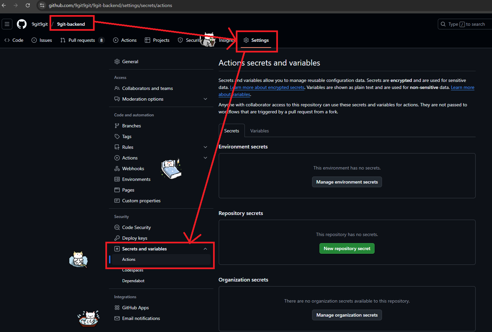
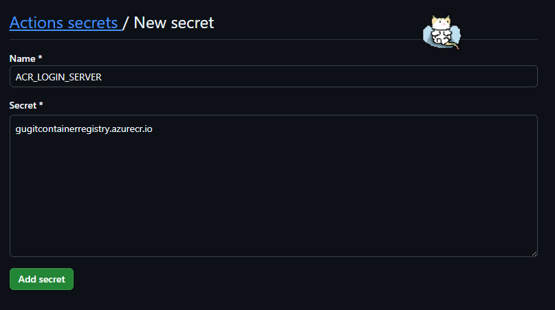

# GitHub Actions로 Azure Container Registry에 이미지 업로드하기

## 1. 준비물

- Azure Service Principal에 대한 정보

## 2. GitHub 저장소 Secrets 설정

> 원래 Secrets에 저장되는 값들이라 공개되면 안되지만 추후 학습을 위해 공개합니다. 중요한 값은 설명만 작성하였습니다.

### 2.1. Azure Service Principal 정보

- GitHub 저장소의 `Settings` > `Secrets and variables` > `Actions` 메뉴로 이동하여 다음 Secrets를 추가합니다.
  - `New repository secret` 버튼을 클릭하여 Secrets를 추가할 수 있습니다.





- `AZURE_CREDENTIALS`

```json
{
  "clientId": "<Application (client) ID>",
  "clientSecret": "<서비스 주체를 생성할 때 얻은 비밀값>",
  "subscriptionId": "<Azure 구독 ID>",
  "tenantId": "<Directory (tenant) ID>"
}
```

### 2.2. Azure Container Registry 정보

> Azure Portal에서 ACR 리소스에 들어가면 `설정` > `액세스 키` 메뉴로 이동하여 다음 정보를 확인할 수 있습니다.

- `ACR_LOGIN_SERVER`

```
gugitcontainerregistry.azurecr.io
```

- `ACR_USERNAME`

```
gugitContainerRegistry
```

- `ACR_PASSWORD`

```
# password 사용하면 된다.
```

### 2.3. 이미지 정보

- `ACR_REPOSITORY_NAME_TEST`

```
gugit-backend-test
```

- `ACR_REPOSITORY_NAME`

```
gugit-backend
```
